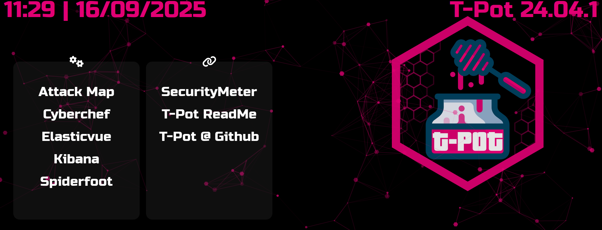

  

# Honeypot Lab (Azure) – Deployment & Analysis

In this project, I set up and analyzed a **honeypot environment** on Microsoft Azure to study real-world attacker behavior.  

- **Part 1 – Deployment:**  
  I deployed a **T-Pot Honeypot Lab** in Azure, configured network security rules, and redirected exposed SSH traffic into the **Cowrie honeypot** for safe monitoring.  

- **Part 2 – Analysis:**  
  I collected logs from Cowrie, built a **Python-based analyzer** to process attacker IPs, credentials, and executed commands, and visualized the findings in a **SOC-style dashboard**.  

The objective was not only to demonstrate how to **deploy honeypots in the cloud**, but also to practice how a **Security Operations Center (SOC)** transforms raw logs into **actionable security intelligence**. This provided hands-on experience in both **cloud security architecture** and **threat analysis**.  

---

## 📑 Project Sections

- [Part One: Honeypot Deployment](docs/SECTION-1.md)
- [Part Two: Honeypot Analysis](docs/SECTION-2.md)
