#  Honeypot Lab Deployment Guide (Azure)

This guide documents how I deployed a **T-Pot Honeypot Lab** on Microsoft Azure.  
The purpose of this lab is to simulate vulnerable systems (honeypots) that attract attackers.  
By analyzing their activity, we gain insight into attack methods, tools, and behaviors.  
#  Introduction: What is a Honeypot?

A **honeypot** is a deliberately exposed system or service designed to attract attackers.  
Instead of protecting valuable assets directly, a honeypot acts as a **decoy target** that lures malicious actors.  

### 🔍 How it Works
1. **Deployment** → The honeypot is set up to look like a real server or application (e.g., SSH, web server, database).  
2. **Attraction** → Attackers scanning the internet will discover the honeypot and attempt to compromise it.  
3. **Interaction** → The honeypot logs every action attackers perform (commands, tools used, payloads).  
4. **Collection** → Security analysts gather data such as attack vectors, IP addresses, malware samples, and exploit attempts.  
5. **Analysis** → This intelligence is used to improve defenses, train SIEM systems, and understand attacker behavior.  

### ⚡ Why Use Honeypots?
- Provide **real-world attack data**  
- Low-cost way to **study emerging threats**  
- Help build **threat detection rules** for SOCs and SIEM tools  
- Can slow down attackers by acting as a diversion  

---

##  Pre-requisites

Before you begin, ensure you have:

- A valid **Microsoft Azure account** → [Sign in here](https://portal.azure.com)  
- Basic understanding of **Linux commands** and SSH  
- Ability to download and use **SSH keys** (`.pem` file)  

#  Create a VM in Azure Portal

1. Go to **[Azure Portal](https://portal.azure.com)**  
2. Navigate to **Virtual Machines**  
3. Click **Create → Azure Virtual Machine**
⚠️ **Note on Azure Costs**  
> Running virtual machines continuously on Azure will consume credits or incur charges.  
> For this project, I am using the **free Azure credit** provided with my account.  
> To avoid unexpected costs:  
> - Use the **smallest VM size** that meets requirements  
> - Enable **Auto-shutdown** when the VM is not in use  
> - **Delete the VM and related resources** (public IP, disks, NICs) when finished  

 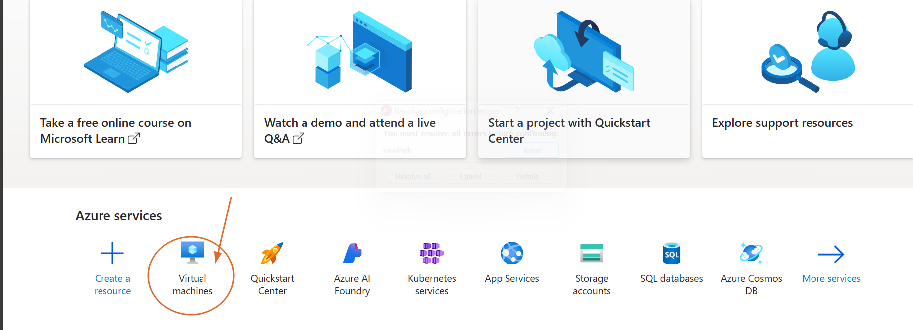
---

## 1. Basics

- **Subscription**: Azure subscription 1  
- **Resource group**: (new) `honeypot-lab1`  
- **Virtual machine name**: `honeypot-lab2`  
- **Region**: West US 2  
- **Availability options**: Availability zone → Zone 1  
- **Security type**: Trusted launch virtual machines  
  - Secure Boot: **Yes**  
  - vTPM: **Yes**  
  - Integrity monitoring: **No**  
- **Image**: Ubuntu Server 24.04 LTS – Gen2  
- **Size**: Standard E2s v3 (2 vCPUs, 16 GiB memory)  

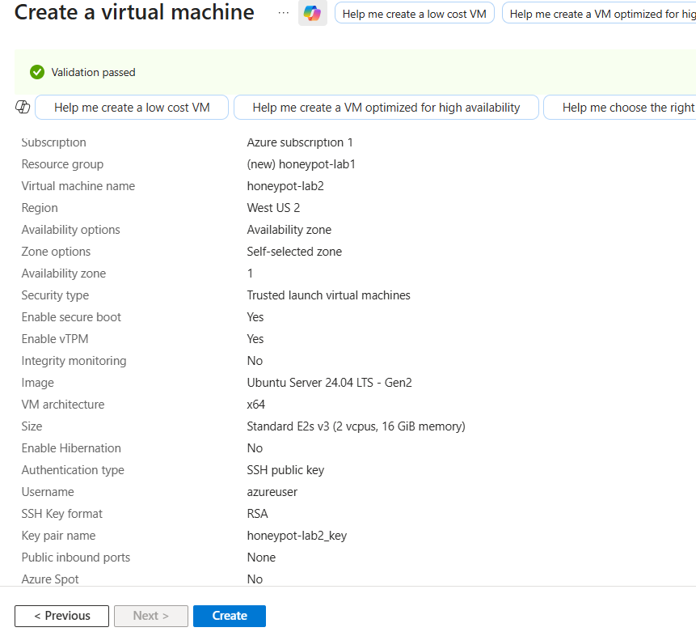

### 🔑 Authentication (Important!)

- **Authentication type**: SSH Public Key ✅ (recommended)  
- **Username**: `azureuser`  
- **SSH Key format**: RSA  
- **Key pair name**: `honeypot-lab2_key`  

⚠️ *Why SSH Keys instead of Passwords?*  
SSH keys are much more secure and prevent brute-force attacks. Since honeypots will attract attackers, password login would expose unnecessary risk. Always use SSH keys.  

- **Public inbound ports**: None (we will open SSH manually later for safety)  
- **Azure Spot**: No  

 
---

## 2. Disks

- **OS disk size**: 128 GiB  
- **OS disk type**: Premium SSD LRS  
- **Use managed disks**: Yes  
- **Delete OS disk with VM**: Enabled  

 
---

## 3. Networking

- **Virtual network**: `vnet-westus2-1`  
- **Subnet**: `snet-westus2-1`  
- **Public IP**: `honeypot-lab2-ip`  
- **Accelerated networking**: On  
- **Load balancer**: None  
- **Delete NIC & IP with VM**: Enabled  

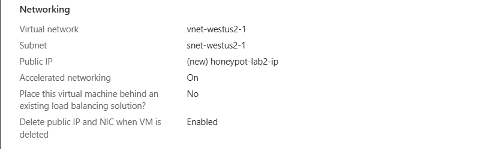
 
---

## 4. Management

- **Microsoft Defender for Cloud**: Basic (free)  
- **System identity**: Off  
- **Auto-shutdown**: On  
- **Backup**: Disabled  
 
 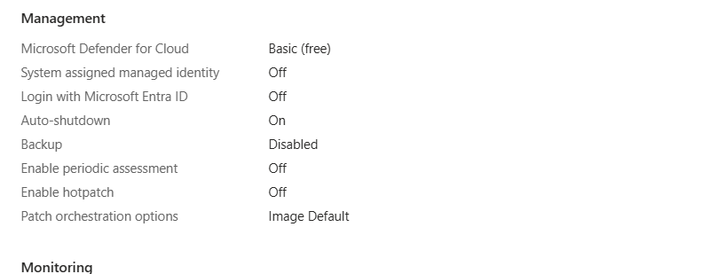
---

## 5. Monitoring

- **Boot diagnostics**: On  
- **OS guest diagnostics**: Off  
- **Application health monitoring**: Off  

 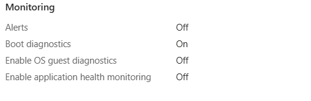
---

## 6. Advanced

- **Extensions**: None  
- **Cloud init / User data**: None  
- **Disk controller**: SCSI  
 
 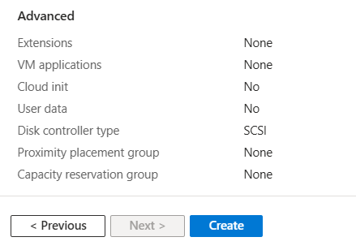
---

## 7. Tags

- Example:  
  - `Project: Honeypot`  
  - `Owner: SecurityLab`  


---

## 8. Review + Create

 Generate & Download SSH Key
- Double-check **SSH Key authentication** is enabled.  
 At this step, Azure will prompt you to **generate a new key pair**.  
Now, **download the private key (`.pem` file)** and save it in a safe location (e.g., `~/Downloads`).  

⚠️ **Note:** If you lose this `.pem` file, you will not be able to log in to the VM later. Azure will not let you re-download it.

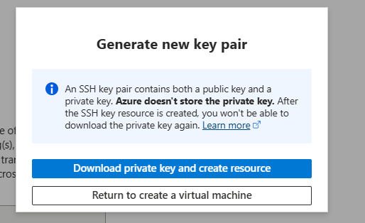

- Click **Create** to deploy your VM.  
After configuring all tabs and confirming your settings, click **Review + Create** to start deployment.  
Please wait a few minutes while Azure provisions your VM.

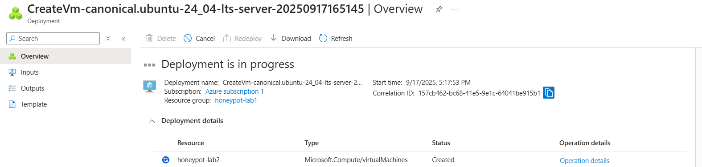
 
## ✅ Deployment Complete

Once the deployment has finished successfully, click **Go to Resource** to open your newly created VM.

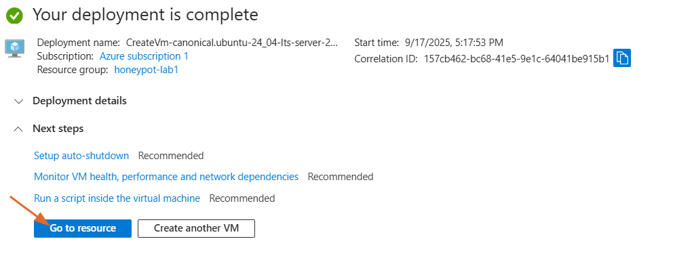 
---
 

## 🔑 Post-Deployment: SSH Access Setup

Since we set inbound ports to **None**, SSH (22) is blocked by default.  
To allow access securely:

1. Go to **Azure Portal → Virtual Machines → honeypot-lab2**.  
2. Open **Networking** → find the **Network Security Group (NSG)**.  
3. Add inbound rule:  
   - **Source**: `My IP`  
   - **Destination**: Any  
   - **Port**: `22`  
   - **Protocol**: TCP  
   - **Action**: Allow  
   - **Priority**: 1000  
   - **Name**: `Allow-SSH-HomeIP`  
   
   Ensure your SSH configuration is correct for accessing the VM.  

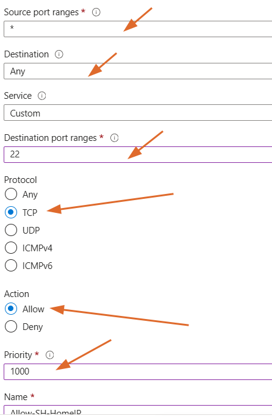

### 🖥️ Connect to the VM

On your local machine(Verify the private key exists), run:

```bash
ls -l ~/Downloads/honeypot-lab2_key.pem
```

Lock the key file permissions (required by ssh):

```bash
chmod 600 ~/Downloads/honeypot-lab2_key.pem   # Secure the key
```

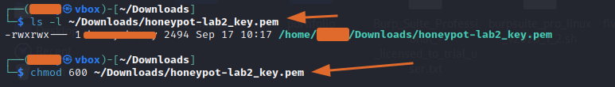


Connect to the VM (default SSH port 22):

```bash
ssh -i ~/Downloads/honeypot-lab2_key.pem azureuser@<AZUREPublic-IP>
```

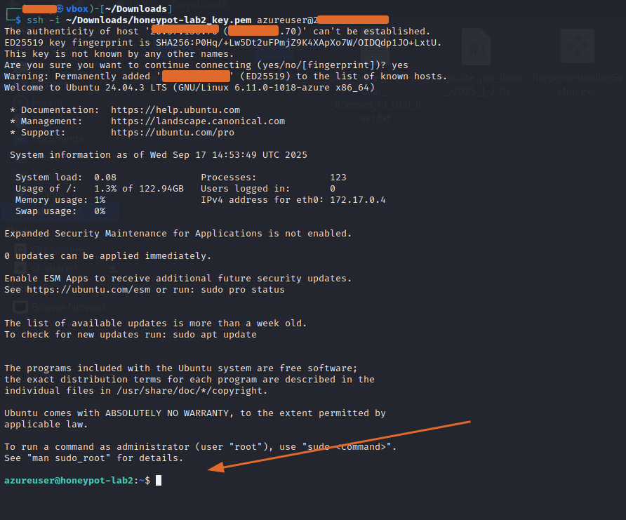


 
 
