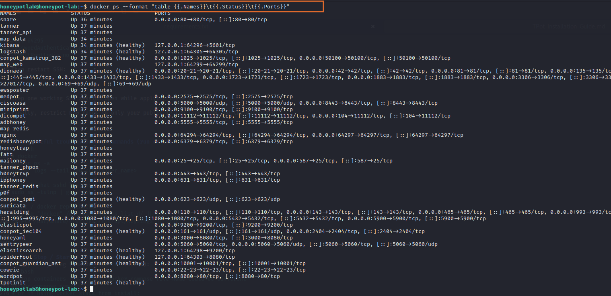

# Part Two: Honeypot Analysis

## 🔧 T-Pot Installation Guide (Installation Phase)

In this phase, I set up **T-Pot**, an all-in-one honeypot platform that integrates multiple honeypot services and monitoring dashboards.

### Steps Covered
1. Provisioned a new VM in **Microsoft Azure**.
2. Configured **network security rules** to allow honeypot traffic.
3. Installed **T-Pot** using the official installer.
4. Verified services with Docker and Portainer.

> **Assumptions (adjust as needed)**  
> - Private key on your local Kali: 
> - VM public IP: `Your Azure ip`  
> - VM admin username: `honeypotlab`  
> - T-Pot web user/pass used in examples: `username / @password`  
> - Installer will move SSH to port `64295` and dashboard listens on `64297`.

---

## 0. Quick notes before starting
- Initial installer will download many Docker images. Ensure you have bandwidth and disk space.
- Work from your local admin machine (Kali). Keep one SSH session open during any SSH-port changes.
- Recommended: take a snapshot of the VM OS disk BEFORE installing (Azure Portal → VM → Disks → Create snapshot).

---

## 1. Verify your public IP (on your local Kali)
```bash
curl -s https://ifconfig.me

```
Use this IP when creating / changing NSG rules.

---

## 2. Ensure your SSH private key is present and locked (on your Kali)
```bash
ls -l ~/Downloads/honeypot_key.pem
chmod 600 ~/Downloads/honeypot_key.pem
```

If the file is somewhere else, use `realpath` to get the full path:
```bash
realpath ~/Downloads/honeypot_key.pem
```

---

## 3. (Optional) Remove old known_hosts entries for the VM
If you previously connected and the host key changed, remove old entries:
```bash
ssh-keygen -R <IP>
ssh-keygen -R "[IP]:64295"
```

---

## 4. SSH into the VM (initial connection on default port 22 if NSG allows)
```bash
ssh -i /home/barry/Downloads/honeypot_key.pem honeypotlab@<Your Azure Ip>
# If the installer later changes the port, use:
# ssh -i /home/barry/Downloads/honeypot_key.pem -p 64295 honeypotlab@Your Azure Ip>
```

Accept the host fingerprint on first connect by typing `yes`.

---

## 5. Snapshot (if not done already)
**Portal**: Virtual machine → Disks → OS disk → Create snapshot  
**Or** (if you have `az` configured on a host):
```bash
RG="honeypot-vm"
VM="honeypot-lab"
OSDISK_ID=$(az vm show -g $RG -n $VM --query "storageProfile.osDisk.managedDisk.id" -o tsv)
SNAP_NAME="honeypot-pre-tpot-$(date +%Y%m%d%H%M)"
az snapshot create --resource-group $RG --name $SNAP_NAME --source $OSDISK_ID
echo "Snapshot created: $SNAP_NAME"
```

---

## 6. Update & basic prep (run on the VM)
```bash
sudo apt update && sudo apt upgrade -y
df -h
free -h
```

Install prerequisites:
```bash
sudo apt install -y git curl apt-transport-https ca-certificates gnupg lsb-release
```

Set Elasticsearch kernel setting:
```bash
echo "vm.max_map_count=262144" | sudo tee /etc/sysctl.d/99-elastic.conf
sudo sysctl -p /etc/sysctl.d/99-elastic.conf
```

---

## 7. Docker installation (preferred official repository)
**Note**: If Docker was previously added by another method, the installer may fail with a Signed-By conflict. We'll install clean and address conflicts if they arise.

Add Docker GPG key & repo, then install:
```bash
# Add key and repository
curl -fsSL https://download.docker.com/linux/ubuntu/gpg | sudo gpg --dearmor   -o /usr/share/keyrings/docker-archive-keyring.gpg

echo "deb [arch=$(dpkg --print-architecture) signed-by=/usr/share/keyrings/docker-archive-keyring.gpg]   https://download.docker.com/linux/ubuntu $(lsb_release -cs) stable" |   sudo tee /etc/apt/sources.list.d/docker.list > /dev/null

sudo apt update
sudo apt install -y docker-ce docker-ce-cli containerd.io docker-compose-plugin
```

Enable and start docker, and allow non-root use:
```bash
sudo systemctl enable docker --now
sudo usermod -aG docker $USER
# apply group change in current session
newgrp docker || true
```

Test docker:
```bash
docker --version
docker info
```

---

## 8. If the installer errors with "Conflicting values set for option Signed-By" (apt/dockergpg conflict)
This happens when two Docker source entries or key files exist. Fix with these steps:

Check existing docker source/key files:
```bash
ls -la /etc/apt/sources.list.d/ | grep docker || true
ls -la /etc/apt/keyrings || true
ls -la /usr/share/keyrings | grep docker || true
```

Remove conflicting files and keep a single keyring file:
```bash
sudo rm -f /etc/apt/sources.list.d/docker.list
sudo rm -f /etc/apt/keyrings/docker.gpg
sudo mkdir -p /usr/share/keyrings
# recreate the expected keyring (run the curl+gpg command above to write docker-archive-keyring.gpg)
curl -fsSL https://download.docker.com/linux/ubuntu/gpg | sudo gpg --dearmor   -o /usr/share/keyrings/docker-archive-keyring.gpg

# re-create the docker.list using the key in /usr/share/keyrings
echo "deb [arch=$(dpkg --print-architecture) signed-by=/usr/share/keyrings/docker-archive-keyring.gpg]   https://download.docker.com/linux/ubuntu $(lsb_release -cs) stable" |   sudo tee /etc/apt/sources.list.d/docker.list > /dev/null

sudo apt update
sudo apt install -y docker-ce docker-ce-cli containerd.io docker-compose-plugin
```

If problems persist, you can purge docker and reinstall clean:
```bash
sudo apt purge -y docker-ce docker-ce-cli containerd.io docker-compose-plugin
sudo apt autoremove -y
# then re-run the docker repo + install commands above
```

---

## 9. Clone T-Pot repo & run installer (run as regular user — NOT with sudo)
```bash
cd ~
git clone https://github.com/telekom-security/tpotce.git
cd tpotce
chmod +x ./install.sh
```

Run the installer as a normal user (example uses hive/full install and provides web credentials):
```bash
./install.sh -t h -u <your userbame> -p '@<your upassword>'
```

**Important**: Do **not** prefix with `sudo`. The script checks and will refuse to run as root.

---

## 10. Typical installer prompts and safe answers
- Continue? → `y`  
- Network interface → choose the NIC with the public IP (check in another SSH window with `ip addr`)  
- Timezone → pick your timezone or accept default  
- Let’s Encrypt / SSL → choose **No** unless you have DNS & certs ready  
- Web UI username/password → you passed `-u` and `-p`; confirm when asked

The installer will download many images and set up multiple containers. This can take few minutes.

---

## 11. Installer failure mid-way (ssh port changed) & how to recover
- The installer may change SSH to a non-default port (e.g., `64295`) and ask you to reconnect.
- If your SSH client reports host key changed, remove old host key on your Kali:
```bash
ssh-keygen -R <ip>
ssh-keygen -R "[1p]:64295"
```
- Add NSG inbound rule for the new SSH port (64295) in Azure Portal before trying to reconnect.
- Reconnect:
```bash
ssh -i /home/barry/Downloads/honeypot_key.pem -p 64295 honeypotlab@<Your Azure ip>
```

---

## 12. After install: reboot and verify containers
When installer finishes it will request a reboot:
```bash
sudo reboot
# then reconnect (use -p 64295 if SSH moved)
ssh -i /home/barry/Downloads/honeypot_key.pem -p 64295 honeypotlab@<Azure ip>
```

Check running containers:
```bash
docker ps --format "table {{.Names}}\t{{.Status}}\t{{.Ports}}"
```



You should see `nginx` mapping `64297->64297/tcp` and many honeypot containers (cowrie, dionaea, elasticsearch, kibana, etc.).

---

## 13. Open T-Pot web UI (add NSG rule for port 64297)
In Azure Portal → VM → Networking → Inbound port rules, add:
- **Name**: `T-Pot-64297`
- **Port**: `64297`
- **Protocol**: `TCP`
- **Source**: your public IP (recommended) or `Any` for quick testing
- **Action**: Allow

From your Kali host:
```bash
curl -k https://azure ip:64297
```
Open `https://azure ip:64297` in a browser and login with the web UI credentials.


---

## 14. Secure SSH (on VM) — finalize hardening
Edit `/etc/ssh/sshd_config` and set:
```
Port 64295
PasswordAuthentication no
PermitRootLogin no
```
Then restart SSH:
```bash
sudo systemctl restart ssh
```
Keep one working SSH session open while applying these changes.

Finally, restrict NSG rules so only your public IP can reach SSH and the dashboard.

---

## 15. Useful troubleshooting commands (run on VM)
```bash
# docker
docker ps -a
docker logs --tail 200 <container_name>

# check what sshd listens on
sudo ss -tulnp | grep ssh

# apt / docker repo checks
grep -r "docker" /etc/apt/sources.list.d/ || true
ls -la /usr/share/keyrings /etc/apt/keyrings || true
```

---

## 16. Stop / Start T-Pot to save credits
- Stop everything (inside `tpotce` folder):
```bash
# stop containers - may vary; docker compose file name could be different
docker compose down
# or if using Docker stack from install:
docker ps -q | xargs -r docker stop
```
- Start again:
```bash
cd ~/tpotce
docker compose up -d
```

To avoid VM compute charges, stop the VM from Azure Portal or use az:
```bash
az vm stop -g honeypot-vm -n honeypot-lab
az vm start -g honeypot-vm -n honeypot-lab
```

---

## 17. Cleanup (if you want to remove everything)
```bash
# remove tpot folder
rm -rf ~/tpotce
# delete VM and resource group (careful: irreversible)
az vm delete -g honeypot-vm -n honeypot-lab --yes
az group delete -n honeypot-vm --yes --no-wait
```

---


## Final notes
- Keep the snapshot handy in case you need to revert.  
- Monitor disk usage (Elastic can grow) and rotate logs if you plan long-running capture.  
- Only open dashboard/SSH ports to your IP for safety.

---

