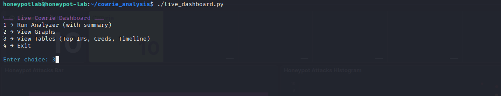

Hosted on an Azure VM running the T-Pot multi-honeypot framework.

SSH port 22/TCP is redirected to the Cowrie honeypot, simulating a real server.

Attacker interactions (IPs, credentials, commands, timelines) are logged.

Logs are processed by a Python analyzer to generate CSVs, graphs, and summaries.

A live terminal dashboard provides a SOC-style monitoring interface.

🔹 Features

Collects and analyzes:

Attacker IPs + geolocation (via ip-api.com API).

Brute-force credential attempts (username/password).

Timeline of hourly attack activity.

Outputs:

CSV reports (cowrie_attackers.csv, cowrie_creds.csv, etc.).

Graphs (top_ips.png, top_creds.png, timeline.png).

Terminal tables (auto-refresh option).

Complements T-Pot’s Kibana dashboards with lightweight, automated summaries.

## 🔹 Setup & Installation,to use this customized tool

1. **Clone the repository**
```bash
git clone https://github.com/abiola-samwel/cowrie_analysis
cd cowrie_analysis
```

2. **(Recommended) Create & activate a Python virtual environment**
```bash
python3 -m venv venv
source venv/bin/activate
```

3. **Install Python dependencies**
```bash
pip install -r requirements.txt
```

4. **Make scripts executable (important)**
Some systems require scripts to be executable to run them directly. Run this in your project directory:
```bash
# make the main scripts executable
chmod +x cowrie_analyzer.py live_dashboard.py

# if you have a test script or helper (e.g. test.py), make it executable too
# chmod +x test.py
```
You can now run the dashboard directly:
```bash
./live_dashboard.py
```

or run the analyzer directly:
```bash
./cowrie_analyzer.py
```
(If a script lacks a shebang or you prefer, use `python3 cowrie_analyzer.py` instead.)

---

## 🔹 Usage

### 1. Run the analyzer
Generates CSVs and graphs from Cowrie logs.
```bash
python3 cowrie_analyzer.py
```
Outputs appear in `analysis_output/`:
- `cowrie_attackers.csv` — attacker IPs + countries
- `cowrie_creds.csv` — captured login attempts
- `cowrie_timeline.csv` — hourly attack counts
- `top_ips.png`, `top_creds.png`, `timeline.png` — visual graphs

### 2. Start the live dashboard
```bash
./live_dashboard.py
```
Menu options:
```
1 → Run Analyzer (generate/refresh reports & graphs)
2 → View Graphs (lists PNGs + how to access them)
3 → View Tables (Top IPs, Credentials, Timeline) [supports auto-refresh]
4 → Exit
```

- Option **3** supports **auto-refresh** (enter interval in seconds).
- Graphs: if running locally, open with your image viewer. If on a remote VM, download via `scp` or SFTP:
```bash
scp honeypotlab@<VM-IP>:~/cowrie_analysis/analysis_output/top_ips.png .
```
---

## 📊 Sample Outputs



*Figure 1: Example visualizations generated by the analyzer (`top_ips.png`, `top_creds.png`, `timeline.png`).*

---

## 🖥️ Tool in Action

<p align="center">
  
</p>

*Figure 2: The interactive terminal dashboard (`live_dashboard.py`) showing top attacker IPs and credential attempts.*

---

## 🔹 T-Pot Dashboards (Web UI)

T-Pot provides web dashboards (Kibana, Portainer, CyberChef, EveBox) for realtime exploration. These are complementary:
- **Kibana** for rich interactive visualizations and searches.
- **This analyzer + dashboard** for fast offline reporting, CSV exports, and quick SOC-style terminal monitoring.

---

## 🔹 Troubleshooting & Tips

- If `tabulate`/`pandas`/`colorama` are missing, install via pip inside your venv:
```bash
pip install pandas tabulate colorama matplotlib requests
```
- If you see permission errors running `docker logs`, run the analyzer with `sudo`, or add your user to the `docker` group:
```bash
sudo usermod -aG docker $USER
# then log out and log back in
```
- If country lookups fail (no local GeoIP DB), the script falls back to `ip-api.com`. Caching reduces repeated lookups.

---

## 🔹 Security & Privacy Notes

- Avoid publishing raw logs or commands — they may contain attacker IPs, URLs, or malware. Use the hashed IP CSV when publishing.
- The analyzer includes basic redaction options (URLs/IPs) if command capture is enabled. For public repos, keep raw command capture local only.

---

## 🔹 Quick Reference Commands

```bash
# show folder structure (directories only)
tree -d -I "venv" -L 2

# make scripts executable
chmod +x cowrie_analyzer.py live_dashboard.py

# run analyzer once (safe)
python3 cowrie_analyzer.py

# run dashboard
./live_dashboard.py

# copy graphs to local machine (from local terminal)
scp -i /path/to/key -P <PORT> honeypotlab@<VM-IP>:~/cowrie_analysis/analysis_output/*.png ~/Downloads/
```

---

## 📂 Project Structure

```
cowrie_analysis/
├── analysis_output/               # ⚠️ Local output folder (not pushed to repo)
│   ├── cowrie_attackers.csv           # Raw attacker IPs (excluded from GitHub)
│   ├── cowrie_attackers_hashed.csv    # Hashed attacker IPs (safe demo)
│   ├── cowrie_cmds.txt                # Raw attacker commands (excluded)
│   ├── cowrie_creds.csv               # Raw credential attempts (excluded)
│   ├── cowrie_timeline.csv            # Hourly attack counts
│   ├── timeline.png                   # Timeline graph
│   ├── top_creds.png                  # Credentials graph
│   └── top_ips.png                    # Top IPs graph
├── cowrie_analyzer.py             # Analyzer script (process Cowrie logs → CSVs/graphs)
├── dashboards/                    # Screenshots from T-Pot dashboards
│   ├── kibana_attacks.png
│   ├── kibana_countries.png
│   └── portainer_view.png
├── live_dashboard.py              # Interactive terminal dashboard
├── requirements.txt               # Python dependencies
```

### 🔹 Notes for Users
- The **`analysis_output/`** folder is **.gitignored** and not fully pushed to GitHub.  
  - This is intentional: it may contain sensitive attacker data (raw IPs, commands, credentials).  
  - When you run the analyzer locally, this folder will be **created automatically** with your own logs.  
